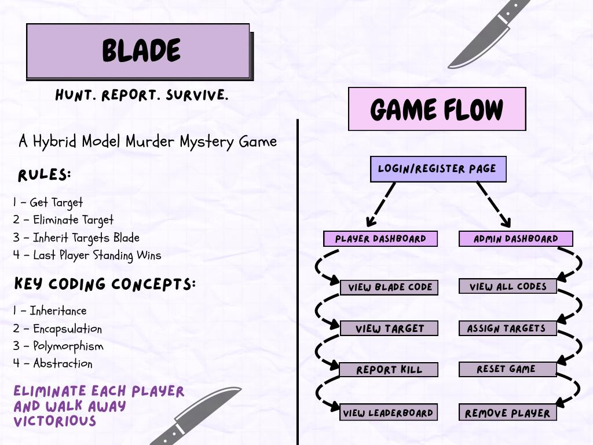

🗡️ Blade - Campus Assassination Game

Blade is a web-based remake of the classic “Assassins” campus game.

Players register, receive secret targets, and log their kills (verified by unique blade codes). A live leaderboard keeps suspense high until one last player remains.

## Who should play Blade?


Blade is perfect for:

- University dorms & hostels – perfect for orientation week or end-of-term stress relief
- Office teams – lighthearted team-building that sparks strategy and camaraderie
- Summer camps & youth groups – easy to run, no fancy gear required
- Any group up for a stealth-and-strategy showdown — if quick wits, covert moves, and topping the leaderboard fire you up, Blade is right in your sweet spot.


##  Core Features

- **Sign-up / Login / Logout** (session-based)
- **Admin panel** to assign targets, reset the game, or remove players
- **Automatic circular target assignment** with one-click shuffle
- **Kill confirmation** via 5-character alphanumeric blade codes
- **Live leaderboard** tracking kills & blades collected
- **GPS location update endpoints** (JSON-based) — handy for map overlays
- **Winner / Eliminated screens** for immersive game flow
- **Auto-refreshing dashboards** — player and admin views update every 5 seconds to reflect live game state
- **Quick reset** to original test players for easy testing & demos

## Tech Stack


**Language:** Python 3.11  
**Framework:** Flask  
**Templating:** Jinja2  
**Frontend:** HTML + Custom CSS  
**Data Storage:** In-memory Python dictionaries  
**Deployment:** Localhost / Replit (for testing)

## Project Structure

blade/
├── .venv/                  → Python virtual environment (not committed)  
├── assets/                 → Project assets like images  
│   └── poster.jpeg         → Header poster for README  
├── static/                 → Static assets like CSS  
│   └── style.css           → Custom styling for UI  
├── templates/              → Jinja2 HTML templates  
│   ├── admin_dashboard.html  
│   ├── dashboard.html  
│   ├── eliminated.html  
│   ├── home.html  
│   ├── leaderboard.html  
│   ├── login_failed.html  
│   ├── login.html  
│   ├── register.html  
│   ├── report_result.html  
│   └── winner.html  
├── .gitignore             
├── main.py                 → Flask application entry point  
├── README.md               → Project documentation  
└── requirements.txt        → Project dependencies (Flask)

##  Local Setup

This project runs on **Python 3.11**.  
Make sure you have **Python 3.11 or higher** installed before running the app.

```bash
# 1. Clone the repo
git clone https://github.com/shajiaalianwar55/blade-game
cd blade

# 2. Create & activate virtual environment
python -m venv .venv
source .venv/bin/activate            # Windows: .venv\Scripts\activate

# 3. Install requirements
pip install Flask

# 4. (Optional) Set your secret key for sessions
export SECRET_KEY="replace_this"     # Windows: set SECRET_KEY=replace_this

# 5. Run the app
python main.py
# → Open http://127.0.0.1:5000 in your browser

```


## Key Endpoints

| Method | Route                     | Description                          |
|--------|---------------------------|--------------------------------------|
| GET    | `/`                       | Home / landing page                  |
| GET/POST | `/register`             | Create a new player account          |
| GET/POST | `/login`                | Login (players & admins)             |
| GET    | `/logout`                | End session                          |
| GET    | `/dashboard`             | Player dashboard / kill submission   |
| GET    | `/leaderboard`           | Live rankings                        |
| GET    | `/location/<username>`   | JSON location of a player            |
| POST   | `/update_location`       | Update current player’s GPS          |
| GET    | `/admin/dashboard`       | Admin control panel                  |
| POST   | `/admin/assign_targets`  | Shuffle & assign targets             |
| POST   | `/admin/remove/<user>`   | Eliminate player (admin)             |
| POST   | `/admin/reset`           | Reset to initial state               |

##  License

This project is **not open-source** and is shared for **educational and demonstration purposes only**.  
All **code**, **design**, **logic**, and the **original idea** behind this project are the intellectual property of:

**Shajia Ali Anwar, Aleena Rizwan, Areeba Rehman, and Sara Faysal © 2025**

> While the traditional *Assassins* game exists in various forms, the concept of turning it into a **web-based hybrid experience** — complete with session-based login, kill verification, live leaderboards, and automated target logic — is the team's original interpretation and implementation.  
> This creative transformation of a physical game into a digital format is what we refer to as the **“original idea”** in this context.

You are welcome to view the repository to understand how the game works.  
However, **reproduction, modification, distribution, or any form of reuse is strictly prohibited** without explicit written permission.

If you'd like to discuss collaboration, learning use, or licensing options, feel free to reach out.

## Authors

This project was collaboratively built with love, logic, and late-night sessions by:

-  Shajia Ali Anwar: https://github.com/shajiaalianwar55
-  Aleena Rizwan: https://github.com/AleenaRizwan
-  Areeba Rehman: https://github.com/RehmanAreeba
-  Sara Faysal: https://github.com/sarafaysal

Feel free to explore our GitHub profiles and reach out if you’re curious about our work or want to collaborate!